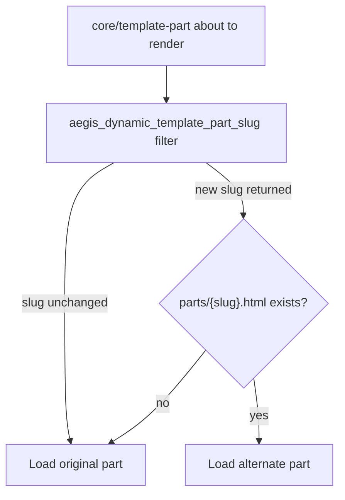

# Dynamic Template Parts

Aegis can swap which template part loads at render time so one template can show a different header, footer, or sidebar based on context — without duplicating nearly identical top-level templates.

This follows the [dynamically loading template parts in block themes](https://developer.wordpress.org/news/2026/06/dynamically-loading-template-parts-in-block-themes/) approach from the WordPress Developer Blog.

## What It Does

Templates keep a single `core/template-part` reference (for example `header`, `footer`, or `sidebar`). Before the block renders, Aegis lets you change the slug through a filter. If the alternate part file exists, WordPress loads it; otherwise the original part is kept.

Out of the box nothing changes visually. Child themes and custom plugins opt in via `aegis_dynamic_template_part_slug`.

## How It Works



1. `render_block_data` intercepts every block before render.
2. For `core/template-part` on the front end, Aegis applies `aegis_dynamic_template_part_slug`.
3. If the filter returns a different slug and `parts/{slug}.html` exists (theme or child theme), that slug is used.
4. Skip-link injection and `aegis_before_*` / `aegis_after_*` hooks fire on whichever part actually renders.

Implemented by `Aegis\Framework\DesignSystem\DynamicTemplateParts`.

## Filter Reference

| Filter | `aegis_dynamic_template_part_slug` |
|--------|-------------------------------------|
| Parameters | `$slug` (string), `$parsed_block` (array) |
| Return | Template part slug string |
| Default | The slug from the block attributes (unchanged) |

Return the original `$slug` (or a non-string / empty value) to leave the part unchanged. Only filesystem parts under the theme’s template-part folder (usually `parts/`) are accepted.

## Examples

Add these to a **child theme** `functions.php` or a small custom plugin. Create the matching `parts/*.html` files first.

### Category-based sidebar on single posts

Assumes the template references `sidebar` (for example `page-with-sidebar` or a custom single layout). Create `parts/sidebar-news.html`, `parts/sidebar-reviews.html`, and so on as needed.

```php
add_filter(
	'aegis_dynamic_template_part_slug',
	static function ( string $slug, array $parsed_block ): string {
		if ( 'sidebar' !== $slug || ! is_singular( 'post' ) ) {
			return $slug;
		}

		$post = get_queried_object();
		if ( ! $post instanceof WP_Post ) {
			return $slug;
		}

		$parts_dir = get_block_theme_folders()['wp_template_part'];

		foreach ( get_the_category( $post->ID ) as $category ) {
			$candidate = 'sidebar-' . $category->slug;
			if ( locate_template( "{$parts_dir}/{$candidate}.html" ) ) {
				return $candidate;
			}
		}

		return $slug;
	},
	10,
	2
);
```

### Minimal header on landing pages

Create `parts/header-landing.html`, then swap when the Blank or landing page template is in use:

```php
add_filter(
	'aegis_dynamic_template_part_slug',
	static function ( string $slug ): string {
		if ( 'header' !== $slug ) {
			return $slug;
		}

		if ( is_page_template( 'blank' ) || is_page_template( 'page-landing' ) ) {
			return 'header-landing';
		}

		return $slug;
	}
);
```

### Simplified checkout footer

Create `parts/footer-checkout.html`:

```php
add_filter(
	'aegis_dynamic_template_part_slug',
	static function ( string $slug ): string {
		if ( 'footer' !== $slug ) {
			return $slug;
		}

		if ( function_exists( 'is_checkout' ) && is_checkout() && ! is_wc_endpoint_url() ) {
			return 'footer-checkout';
		}

		return $slug;
	}
);
```

## Creating Alternate Parts

Prefer **filesystem** parts in the theme or child theme:

```
parts/header-landing.html
parts/footer-checkout.html
parts/sidebar-news.html
```

You can use a thin pattern wrapper (same as the shipped `header`, `footer`, and `sidebar` parts) or full block markup.

Site Editor–created template parts are unreliable for custom slugs today ([Gutenberg #57629](https://github.com/WordPress/gutenberg/issues/57629)). Control slugs via theme files whenever possible.

## Related

- [[template-parts]] — Header, footer, and sidebar parts
- [[hooks-and-filters]] — Filter reference including `aegis_dynamic_template_part_slug`
- [[hook-patterns]] — Injection hooks around template parts
- [Dynamically loading template parts in block themes](https://developer.wordpress.org/news/2026/06/dynamically-loading-template-parts-in-block-themes/) — Developer Blog tutorial
