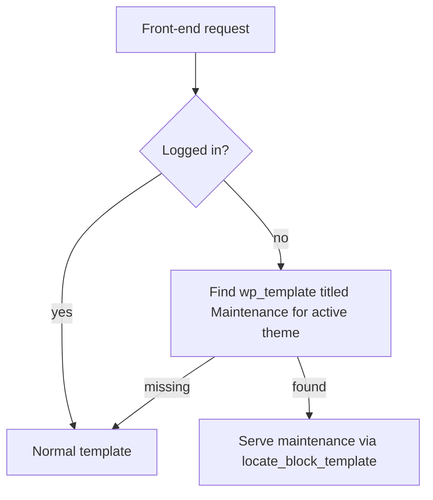

# Maintenance Mode

Aegis ships an on-brand Maintenance template and pattern so you can present a planned-outage page that matches Global Styles. Forcing that template for logged-out visitors requires a small `template_include` hook in a child theme or custom plugin — the parent theme does not activate maintenance mode by itself.

This approach follows the [on-brand maintenance mode for block themes](https://developer.wordpress.org/news/2026/07/on-brand-maintenance-mode-for-wordpress-block-themes/) pattern from the WordPress Developer Blog.

## Important Distinction

This is **not** WordPress core update maintenance mode.

| Mechanism | When it runs | What visitors see |
|-----------|--------------|-------------------|
| Core `.maintenance` / `wp_is_maintenance_mode()` | During core, plugin, or theme updates | Plain “Briefly unavailable…” message (or `wp-content/maintenance.php` if present) |
| Aegis Maintenance template + optional hook | When you intentionally enable it | Branded Site Editor template with Global Styles |

The snippets below do **not** call `wp_is_maintenance_mode()`. They serve a Site Editor template titled **Maintenance** for logged-out visitors.

## What Aegis Ships

| File | Role |
|------|------|
| `templates/maintenance.html` | Theme template that loads the maintenance pattern |
| `patterns/template/maintenance.php` | Branded layout (header, cover message, login link, footer) |

The pattern file header uses `Slug: maintenance`, but the framework registers patterns as `{category}-{slug}`. The effective pattern slug is **`template-maintenance`**, which is what the template references.

Edit copy and layout in **Appearance → Editor → Templates → Maintenance**. Global Styles (fonts, colors, spacing) apply automatically. You can also reuse the `notice-under-construction` notice pattern if you prefer a lighter placeholder inside another template.

## How Activation Works

With the advanced hook in place:



Logged-in users always see the live site so your team can work during an outage window.

**Important:** The hook looks for a database-backed `wp_template` post titled exactly **Maintenance** for the active theme. The shipped theme file alone does not satisfy that check until the template exists or is customized in the Site Editor (which stores it in the database).

## Advanced: Add the Hook

Add the filter in a **child theme** `functions.php` or a small custom plugin. Do not edit the Aegis parent theme — updates would overwrite your changes.

### Minimal approach

Suitable for short, routine update windows:

```php
/**
 * Serve the template titled "Maintenance" if the template exists.
 *
 * @param string $template The path to the template.
 * @return string The maintenance template path, or the original template.
 */
function aegis_child_force_maintenance_template( $template ) {
	if ( is_user_logged_in() ) {
		return $template;
	}

	if ( ! current_theme_supports( 'block-templates' ) ) {
		return $template;
	}

	$maintenance_posts = get_posts(
		array(
			'post_type'      => 'wp_template',
			'title'          => 'Maintenance',
			'post_status'    => array( 'publish', 'draft' ),
			'posts_per_page' => -1,
			'no_found_rows'  => true,
		)
	);

	$maintenance_post = null;

	foreach ( $maintenance_posts as $post ) {
		$theme_slugs = wp_get_post_terms( $post->ID, 'wp_theme', array( 'fields' => 'names' ) );
		if ( in_array( get_stylesheet(), $theme_slugs, true ) ) {
			$maintenance_post = $post;
			break;
		}
	}

	if ( ! $maintenance_post ) {
		return $template;
	}

	$slug = $maintenance_post->post_name;

	return locate_block_template( $template, $slug, array( $slug ) );
}
add_filter( 'template_include', 'aegis_child_force_maintenance_template', 99 );
```

### SEO-friendly headers approach

Use this when search traffic matters or maintenance windows may last longer. Headers are sent only when a maintenance template is actually served:

```php
/**
 * Serve the template titled "Maintenance" if the template exists.
 * Includes headers to signal temporary unavailability to search engines.
 *
 * @param string $template The path to the template.
 * @return string The maintenance template path, or the original template.
 */
function aegis_child_force_maintenance_template( $template ) {
	if ( is_user_logged_in() ) {
		return $template;
	}

	if ( ! current_theme_supports( 'block-templates' ) ) {
		return $template;
	}

	$maintenance_posts = get_posts(
		array(
			'post_type'      => 'wp_template',
			'title'          => 'Maintenance',
			'post_status'    => array( 'publish', 'draft' ),
			'posts_per_page' => -1,
			'no_found_rows'  => true,
		)
	);

	$maintenance_post = null;

	foreach ( $maintenance_posts as $post ) {
		$theme_slugs = wp_get_post_terms( $post->ID, 'wp_theme', array( 'fields' => 'names' ) );
		if ( in_array( get_stylesheet(), $theme_slugs, true ) ) {
			$maintenance_post = $post;
			break;
		}
	}

	if ( ! $maintenance_post ) {
		return $template;
	}

	$slug = $maintenance_post->post_name;

	$maintenance_template = locate_block_template( $template, $slug, array( $slug ) );

	if ( ! empty( $maintenance_template ) ) {
		nocache_headers();
		status_header( 503 );
		header( 'Retry-After: 3600' );
		return $maintenance_template;
	}

	return $template;
}
add_filter( 'template_include', 'aegis_child_force_maintenance_template', 99 );
```

- `status_header( 503 )` — temporary unavailability for crawlers.
- `Retry-After: 3600` — suggests checking back in one hour (adjust as needed).
- `nocache_headers()` — avoids CDNs caching the maintenance response after you turn it off.

## Activate and Deactivate

1. **Activate** — In **Appearance → Editor → Templates**, create or keep a template titled exactly **Maintenance** (WordPress assigns the slug `maintenance`). Customize the shipped theme template if you prefer; customization stores a DB copy the hook can find.
2. **Deactivate** — Rename or delete that customized Maintenance template. No code change is required once the hook is installed.

## Testing

1. Ensure the Maintenance template exists in the Site Editor and the hook is active.
2. Log out (or use a private window) and visit the site — you should see the maintenance page.
3. Log in and confirm the live site loads normally.
4. When finished, rename or delete the Maintenance template to turn mode off.

## Related

- [[templates]] — Template usage guide
- [[template-reference]] — Template reference table
- [[site-editor]] — Editing templates in the Site Editor
- [On-brand maintenance mode for WordPress Block Themes](https://developer.wordpress.org/news/2026/07/on-brand-maintenance-mode-for-wordpress-block-themes/) — Developer Blog tutorial
